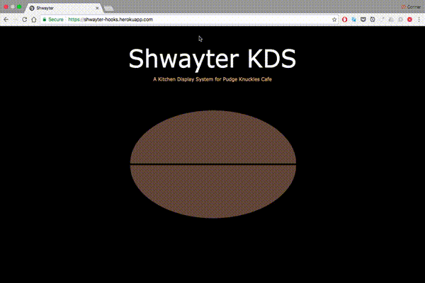
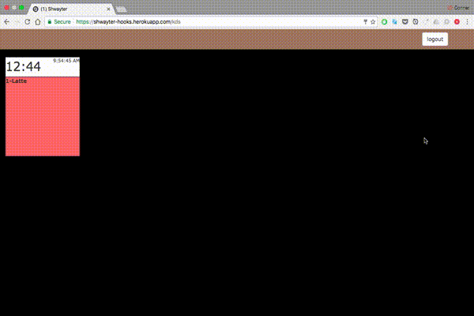
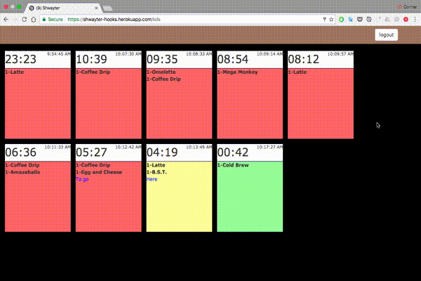

# Shwayter

A program to send orders from the register to the kitchen using webhooks in Square's connect api (https://docs.connect.squareup.com/api/connect/v1/#webhooks-overview).  The program is made using the MEAN stack.  Currently, it is only supported for use at Pudge Knuckles Cafe (http://www.pudgeknuckles.com/).

## Logging In

Simply, hover over the coffee bean and enter a preregistered email address and password.

## Receiving Orders

The orders will start popping up on the screen as they come in via Square's webhooks.  This will cause a delay of ~20 seconds (they claim up to 60) since Square has a delay of when they post their calls.

## Order Functionality

Each order will have a timer and a time stamp.  The color of the order will change depending on the amount of time that has passed.  In this case, the orders change from green to yellow at 3 minutes and from yellow to red at 5 minutes.  This is to ensure that the person in the kitchen knows how long the order has been sitting.

## Finishing Orders

Once the order is completed, click on the white header of the order to remove it from the queue. 

